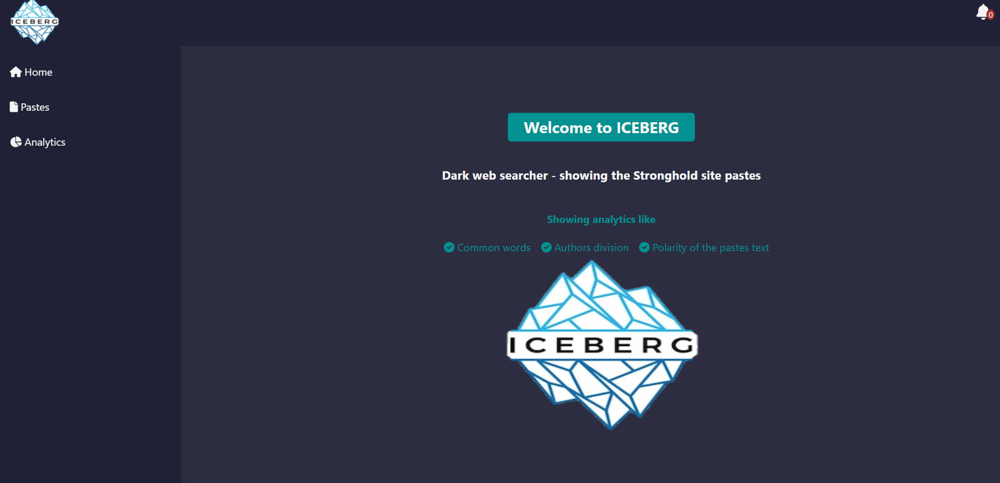
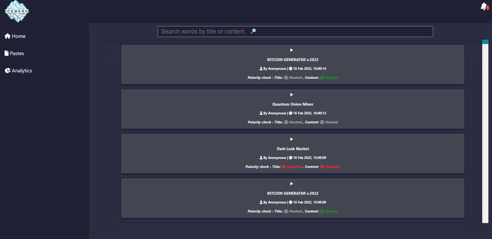
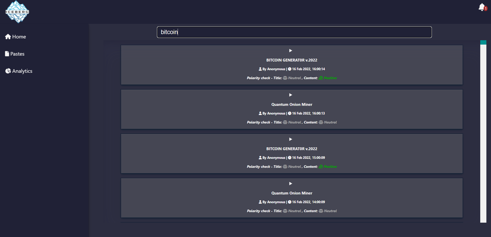
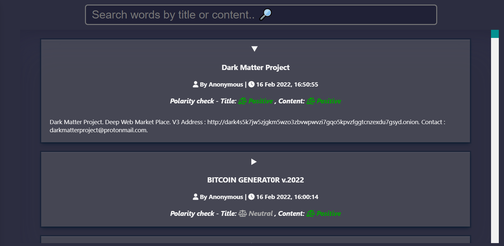
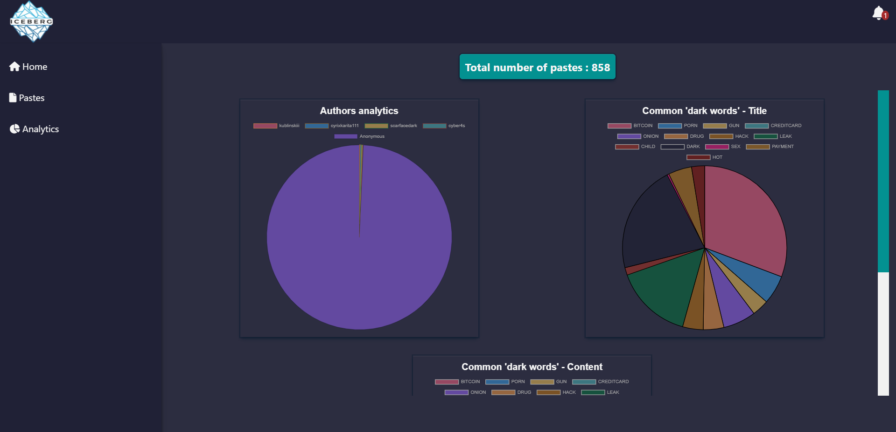
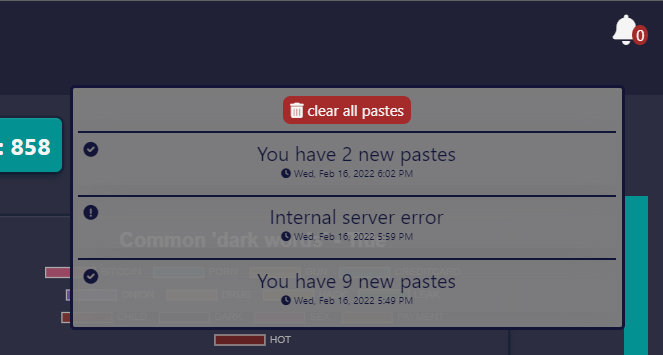

# Intsights threat intelligence challenge

## Dark-web scraper and analyzer

## 

---

### Technologies in use - 👩‍💻👨‍💻

- **[React](https://reactjs.org/)**
- **[TypeScript](https://www.typescriptlang.org/)**
- **[Python](https://www.python.org/)**
- **[MongoDB](https://www.mongodb.com/)**

#### Packages - 📦

- **Front-end : [Axios](https://www.npmjs.com/package/axios) - For API requests | [react-chartjs-2](https://www.npmjs.com/package/react-chartjs-2) - For graphs | [react-debounce-input](https://www.npmjs.com/package/react-debounce-input) - For omni-search | [moment](https://momentjs.com/) - For dates | [sentiment](https://www.npmjs.com/package/sentiment) - For sentiment analysis | [React Router DOM](https://www.npmjs.com/package/react-router-dom) - For single page app |**

- **Back-end : [fastapi](https://fastapi.tiangolo.com/) - To create a server | [pymongo](https://pymongo.readthedocs.io/en/stable/) - For mongoDB connection | [sse_starlette](https://github.com/sysid/sse-starlette) - For server-send-events | [bs4](https://pypi.org/project/bs4/) - For scraping | [requests]() - For http requests | [dotenv]() - For environment Variables |**

---

## Development challenges - 💪

- **Learning "Python" on my own**
- **My first "Python" project 😱1️⃣ - Writing a server, connecting to db, using directories, server send events and scraping**
- **First time using a proxy**
- **First acquaintance with the dark web and Tor's browser in particular**

---

## My app - Iceberg 🧊

## So, how does it work ❓

- **Information on pastes is collected from the "Stronghold" website every 2 minutes**
- **The information is processed and stored in mongoDB**
- **When a user logs in to the dashboard : 1️⃣ He gets the information stored so far . 2️⃣ A stream connection is established**
  - **If there are new updates - will send up-to-date information to the customer with the new analytics and pastes**
  - **Otherwise nothing will be sent and in 2 minutes another scrape will be done**

#### Good to know: ❗

- **For efficiency - the site is only scraped until the last post saved on a server that has already been scraped. If no one is found, it will be scanned to the last page! Save a lot of time! ⏳**
- **The client only receives the complete information once and only receives the updated information if any**

## Features - 💫

- **Over 800 pastes and counting! 🔄**
- **You can see all the Pastes posted on the site and collected 📃**
- **You can see an analysis of the data 📊**
- **You will be notified if new information has been received or a system error has occurred 🔔**
- **Search by title and content 🔎**
- **Displays the polarity of each title and content on the paste ⚖**

## Future Plans 📅👩‍🚀

#### Front:

- **State management with contextAPI or Redux 👩‍💼**
- **Pagination 📃**
- **Implementation custom alerts 🔔**
- **Search - pull only necessary pates by pagination 🔎**
- **On new pastes notification - move to the paste**
- **Users 👥**

#### Back:

- **Routers division 📂**
- **Pagination - taking from db limited number of pastes bu query 📃**
- **Dates analytics 📅**
- **NER & Sentiment analytics - in the server 💘**
- **Implementation custom alerts 🔔**
- **Better error handling**

#### General:

- **Cleaning logs and code in general 🧹🧼**
- **Divide into neat folders in the backend (still studying Python Import and Export files as package) 📂**
- **Tests 💯**
- **Dockerize the app 🐳**
- **Deployment 🌎**
- **Github workflows 🐱‍💻**

---

## Screenshots 📸 -

## 

## 

## 

## 

## 

## 

---

## © All rights reserved to Intsights

